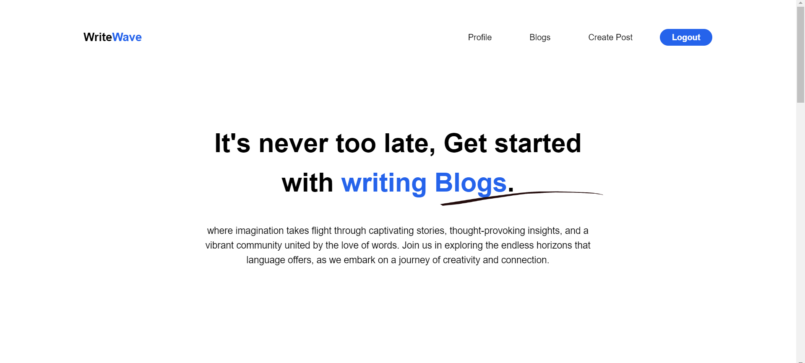
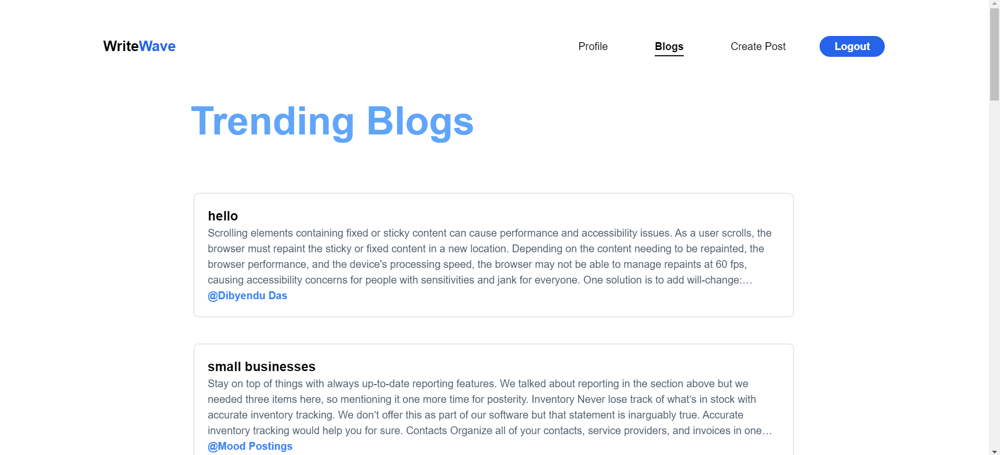
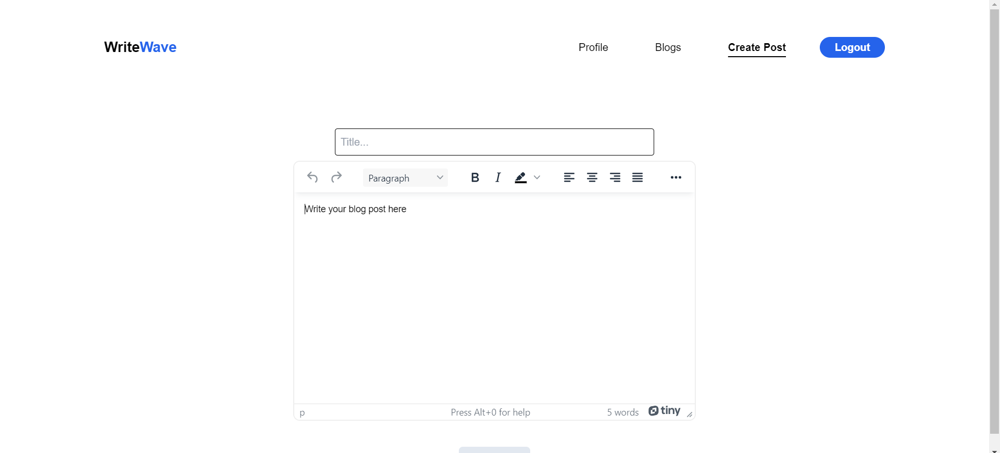

<a name="readme-top"></a>

<!-- PROJECT LOGO -->
<br />
<div align="center">

  <a href="https://github.com/dibyendu02/Writewave">
    <div style="background-color: white; width: 100px">
        
    </div>
  </a>

<h3 align="center">Writewave</h3>

[![Forks][forks-shield]][forks-url]
[![Stargazers][stars-shield]][stars-url]
[![Issues][issues-shield]][issues-url]
[![LinkedIn][linkedin-shield]][linkedin-url]

<p align="center">
   A blog website for all where everyone can post their blog and browse other blogs in the platform.

   <br />
   <a href="https://github.com/dibyendu02/Writewave"><strong>Explore Code »</strong></a>
   <br />
   <br />
   <a href="https://writewave.vercel.app/" target="_blank" rel="noopener noreferrer" >View Demo</a>
   ·
   <a href="https://github.com/dibyendu02/Writewave/issues">Report Bug</a>
   ·
   <a href="https://github.com/dibyendu02/Writewave/
issues">Request Feature</a>
 </p>
</div>

Writewave is a web application that enables users to write any blog at ease and post it publicly and share it with others. Writewave provides a dedicated page for each writer with all his blogs as profile page.

<!-- TABLE OF CONTENTS -->
<details>
  <summary>Table of Contents</summary>
  <ol>
    <li>
      <a href="#about-the-project">About The Project</a>
      <ul>
        <li><a href="#features">Feautures</a></li>
      </ul>
      <ul>
        <li><a href="#technologies-i-used">Technologies I Used</a></li>
      </ul>
      <ul>
        <li><a href="#folder-structure">Folder Structure</a></li>
      </ul>
      <ul>
        <li><a href="#screenshots">Screenshots</a></li>
      </ul>
    </li>
    <li>
      <a href="#getting-started">Getting Started</a>
      <ul>
        <li><a href="#prerequisites">Prerequisites</a></li>
        <li><a href="#steps-to-run">Steps to run</a></li>
      </ul>
    </li>
    <li><a href="#contributing">Contributing</a></li>
    <li><a href="#contact">Contact</a></li>
  </ol>
</details>

<!-- ABOUT THE PROJECT -->

## About The Project

### Features

- Write blogs at ease and post it publicly
- Browse others' blogposts and read them
- Profile page containing all the blogs of that writer

### Technologies Used

- **Backend**: Firestore, Firebase Auth
- **Frontend**: React, Tailwind CSS

## Folder Structure

```plaintext
src/
|-- components/
|   |-- CalltoAction.js
|   |-- Footer.js
|   |-- Hero.js
|   |-- Navbar.js
|   |-- TestimonialCard.js
|   |-- Testimonials.js
|-- pages/
|   |-- Blogs.js
|   |-- CreatePost.js
|   |-- Home.js
|   |-- Login.js
|   |-- Profile.js
|   |-- ViewPost.js
|   |-- ViewUser.js
|-- App.js
|-- index.js
|-- ...
```


### Screenshots

<details>
   <summary><strong>Show</strong> </summary>






</details>

<p align="right">(<a href="#readme-top">back to top</a>)</p>

<!-- GETTING STARTED -->

## Getting Started

Running a development environment for this project will be the easiest thing in you day.

### Prerequisites

- [**Node**](https://nodejs.org/en/)

### Steps to run

To run the application locally, follow these steps:

1. Clone the repository:

   ```bash
   git clone https://github.com/dibyendu02/Writewave.git
   ```

2. Run both command separately to setup the codebase:

   ```bash
    npm install && npm start
   ```

<!-- - or Use Docker Compose

  ```bash
  docker compose up
  ```

- or Run the following command to start using `concurrently`

  ```zsh
  chmod +x quickStart.sh
  /.quickStart.sh
  ```

<br />

> If any issue occured ... -->

<p align="right">(<a href="#readme-top">back to top</a>)</p>

<!-- CONTRIBUTING -->

## Contributing

Contributions are what make the open source community such an amazing place to learn, inspire, and create. Any contributions you make are **greatly appreciated**.

If you have a suggestion that would make this better, please fork the repo and create a pull request. You can also simply open an issue with the tag "enhancement".
Don't forget to give the project a star! Thanks again!

1. Fork the Project
2. Create your Feature Branch (`git checkout -b feature/AmazingFeature`)
3. Commit your Changes (`git commit -s -m 'Add some AmazingFeature'`)
4. Push to the Branch (`git push origin feature/AmazingFeature`)
5. Open a Pull Request
6. Wait for review

See the [open issues](https://github.com/dibyendu02/Writewave/issues) for a full list of proposed features (and known issues).

<!-- CONTACT -->

## Contact

Your Name - Dibyendu Das [@dibyendu02](https://twitter.com/dasdibyenduu) - [get2dibyendu@gmail.com](mailto:get2dibyendu@gmail.com)

Project Link: [https://github.com/dibyendu02/Writewave](https://github.com/dibyendu02/Writewave)

**Thanks for visiting my project. If you like it, please give it a star. It will help me a lot. Thanks again!**

<p align="right">(<a href="#readme-top">back to top</a>)</p>

<!-- MARKDOWN LINKS & IMAGES -->
<!-- https://www.markdownguide.org/basic-syntax/#reference-style-links -->

[forks-shield]: https://img.shields.io/github/forks/dibyendu02/Writewave?style=for-the-badge
[forks-url]: https://github.com/dibyendu02/Writewave/fork
[stars-shield]: https://img.shields.io/github/stars/dibyendu02/Writewave?style=for-the-badge
[stars-url]: https://github.com/dibyendu02/Writewave/stargazers
[issues-shield]: https://img.shields.io/github/issues/dibyendu02/Writewave?style=for-the-badge
[issues-url]: https://github.com/dibyendu02/Writewave/issues
[linkedin-shield]: https://img.shields.io/badge/-LinkedIn-black.svg?style=for-the-badge&logo=linkedin&colorB=555
[linkedin-url]: https://linkedin.com/in/dibyendu02
[React.dev]: https://img.shields.io/badge/React-2496ed?style=for-the-badge&logo=react&logoColor=white
[React-url]: https://www.docker.com/
[Express.com]: https://img.shields.io/badge/Express-2496ed?style=for-the-badge&logo=express&logoColor=white
[Express-url]: https://www.docker.com/
[Node.com]: https://img.shields.io/badge/Nodejs-2496ed?style=for-the-badge&logo=nodejs&logoColor=white
[Node-url]: https://www.docker.com/